<a name="top"></a>



`Roblox Developer` · `Luau` · `C++`

[skills](#skills) · [stack](#stack) · [about](#about) · [faq](#faq) · [reach](#reach)

---

I build things as a hobby,, usually complex projects I get way too excited about and then scrap right after finishing. Still a perfectionist about it. Nothing really feels "done."

<br>

<h3 id="stack">◆ stack</h3>

```luau
local dev = {
    name   = "Iyorie.reverie",
    role   = "Roblox Developer",
    stack  = { "Luau", "C++", "???" },
    status = "luvluvsz.. zzz",
}

return dev
```

<br>

<h3 id="skills">◆ skills</h3>

|  |  |
|---|---|
| **Gameplay systems** | core mechanics, clean architecture, wide accessibility across the board |
| **Performance tuning** | optimize that, optimize there, debug everything and you're done |
| **UI/UX in Studio** | still inexperienced, but I can bring something to the table |
| **Tooling** | tooling? hell no |
| **Cross-language experiments** | currently in C++, on purpose, comparing how I solve the same problems outside Luau |

<sub>[↑ back to top](#top)</sub>

<br>

<h3 id="about">◆ about</h3>

Roblox developer working in Luau, poking at C++ on purpose lately, just to compare how the same problem feels outside my main stack. i love tutels btw.

<br>

<h3 id="faq">◆ faq, kind of</h3>

<details>
<summary>what do you build in Roblox?</summary>
<br>
Usually, for hobbies, I challenge myself with complex but cool-looking projects. Then I scrap everything after. lol.
</details>

<details>
<summary>why step outside Roblox?</summary>
<br>
Roblox's pretty boring these days. If you see me in a game, hi.
</details>

<details>
<summary>what are you learning next?</summary>
<br>
Haven't decided yet. We'll see.
</details>

<details>
<summary>open to collabs or hiring?</summary>
<br>
No. If that changes, contact me on Discord.
</details>

<sub>[↑ back to top](#top)</sub>

<br>

<h3 id="reach">◆ reach</h3>

coding since 2022 · [Discord](https://discordapp.com/users/963993136168849418) `._math.asin` · [Roblox](https://www.roblox.com/users/5300801005/profile)

<sub>status: <!--STATUS:START-->luvluvsz.. zzz<!--STATUS:END--></sub>

---

<sub>lyorie.nihil x Cinn ★ Roblox Developer</sub>
