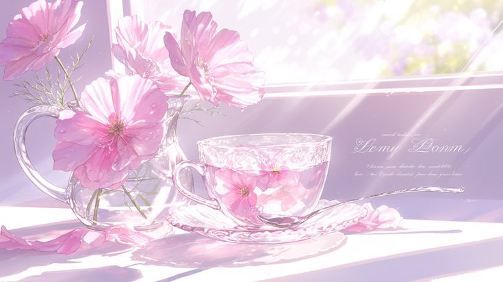
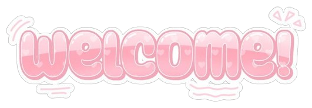
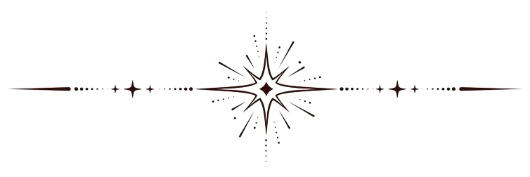
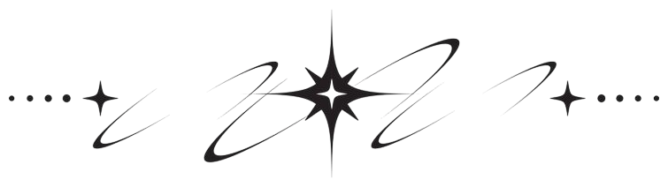

  

  

  

  <a href="#skills">skills</a> ⋆
  <a href="#stack">stack</a> ⋆
  <a href="#about">about</a> ⋆
  <a href="#faq">faq</a> ⋆
  <a href="#reach">reach</a>

  

i build things as a hobby,, usually complex projects i get way too excited about and then scrap right after finishing. still a perfectionist about it. nothing really feels "done."

  

<h3 id="skills" align="center">˚⋆｡ skills ｡⋆˚</h3>

- ♡ **gameplay systems** — core mechanics, clean architecture, wide accessibility across the board
- ♡ **performance tuning** — optimize that, optimize there, debug everything and you're done
- ♡ **UI/UX in studio** — still inexperienced, but i can bring something to the table
- ♡ **tooling** — tooling? hell no
- ♡ **cross-language experiments** — currently in C++, on purpose, comparing how i solve the same problems outside luau

  

<h3 id="stack" align="center">˚⋆｡ stack ｡⋆˚</h3>

  
  
  
  

> name — Iyorie.reverie
> role — Roblox Developer
> stack — Luau · C++ · JavaScript · ???
> status — <!--STATUS:START-->luvluvsz.. zzz<!--STATUS:END-->

  

<h3 id="about" align="center">˚⋆｡ about ｡⋆˚</h3>

roblox developer working in luau, poking at c++ on purpose lately, just to compare how the same problem feels outside my main stack. i love tutels btw.

  

<h3 id="faq" align="center">˚⋆｡ faq, kind of ｡⋆˚</h3>

♡ what do you build in roblox?

 
usually, for hobbies, i challenge myself with complex but cool-looking projects. then i scrap everything after. lol.

♡ why step outside roblox?

 
roblox's pretty boring these days. if you see me in a game, hi.

♡ what are you learning next?

 
haven't decided yet. we'll see.

♡ open to collabs or hiring?

 
no. if that changes, contact me on discord.

  

<h3 id="reach" align="center">˚⋆｡ reach ｡⋆˚</h3>

  

  coding since 2022 ⋆
  
  <code>._math.asin</code> ⋆
  

  

Iyorie.reverie ⋆ Cinn ⋆ Roblox Developer

<a href="#top">↑ back to top</a>

